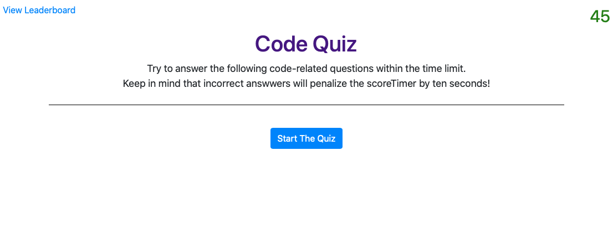

# Code Quiz

## General info
Create a timed quiz on Javascript that stores high scores so that you can gauge your progress against your peers.

## Features

* Timer starts to countdown once quiz is started.
* When incorrect answer is given you are penalized 10 seconds on the timer.
* The game is over when:
  * Timer runs out.
  * All questinons are answered.
* When the game is over you can save your name and score to the leaderboard.
* When viewing the leaderboard you can clear all scores.

	
## Technologies
Project is created with:
* Javascript
* CSS
* HTML

## Link to deployed application 

[Code Quiz](https://www.google.com)